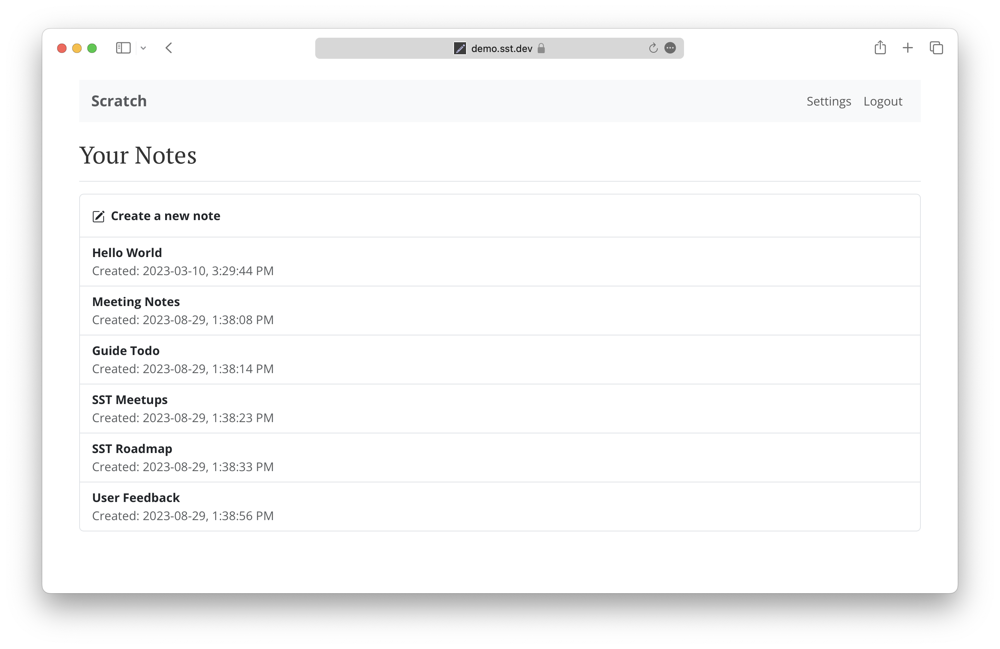

# ExplAIn - Bringing Historic Artifacts Alive

This project was built for the a16z and OpenAI Consumer IA hackathon in NYC on 11/09/2024. This project is an education tool to make learning more fun, allowing anyone to bring historic artifacts alive. For example let a statue of Lucius Verus tell you about himself and the Roman Empire.

Demo Video Here: https://drive.google.com/file/d/1GPcMxVI1bbCewQv0p9UF2x3scWO2iEEQ/view?usp=sharing

This project uses Luma Labs WebGL SDK and scanning technology as well as AI APIs from ElevenLabs and Captions. Built on AWS extending the below SST demo-notes-app (https://github.com/sst/demo-notes-app)


# --- built on top of SST's AWS serverless, React,Terraform Notes sample below ----

The [SST Guide](https://sst.dev/guide) is a comprehensive open source tutorial for building and deploying full-stack apps using serverless and React on AWS.

We create a note taking app from scratch — [**demo.sst.dev**](https://demo.sst.dev)



We use React.js, AWS Lambda, API Gateway, DynamoDB, and Cognito. This repo is a full-stack serverless app built with SST.

- The `infra/` directory defines our AWS infrastructure.
- The `packages/functions` directory contains the Lambda functions that power the CRUD API.
- The `packages/frontend` directory contains the React app.

It's a single-page React app powered by a serverless CRUD API. We also cover how add user authentication, handle file uploads, and process credit card payments with Stripe.

### Prerequisites

Before you get started:

1. [Configure your AWS credentials](https://docs.sst.dev/advanced/iam-credentials#loading-from-a-file)
2. [Install the SST CLI](https://ion.sst.dev/docs/reference/cli/)

### Usage

Clone this repo.

```bash
git clone https://github.com/sst/notes.git
```

Install dependencies.

```bash
npm install
```

This project uses a secret that we are not checking in to the repo. Make sure to [create one before deploying](https://sst.dev/chapters/handling-secrets-in-sst.html).

```bash
sst secret set StripeSecretKey <YOUR_STRIPE_SECRET_TEST_KEY>
```

#### Developing Locally
http://localhost:5173/

From your project root run: // Ajc: run this for localhost
```bash
npx sst dev
```

This will start your frontend and run your functions [Live](https://ion.sst.dev/docs/live/).

#### Deploying to Prod

Run this in the project root to deploy it to prod.

```bash
npx sst deploy --stage prod
```


Make sure to set your secret for prod as well.

```bash
sst secret set StripeSecretKey <YOUR_STRIPE_SECRET_TEST_KEY> --stage production
```

---

Join the SST community over on [Discord](https://discord.gg/sst) and follow us on [Twitter](https://twitter.com/SST_dev).
